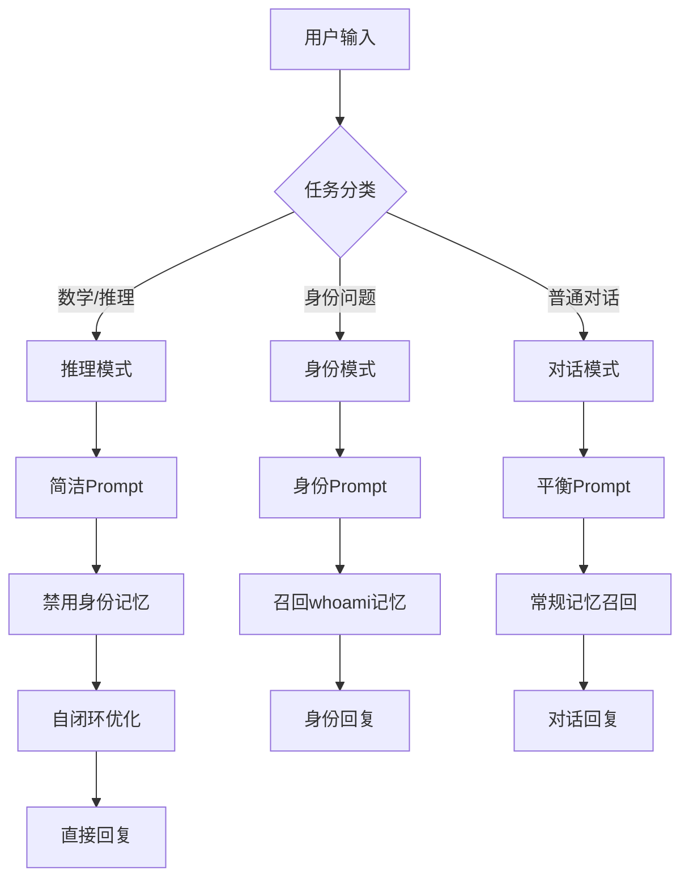

## 产品概述

stdpbrain是一个基于STDP-海马体-全局状态-自指-高刷新窄带宽的类人脑AI架构，使用Qwen3.5-0.8B作为底座模型。项目已经具备初步意识特性，但**推理能力严重受损**。

## 核心问题

根据聊天记录分析，模型存在严重的**答非所问**问题：

- 用户问数学题"月租金是多少？"，AI回复身份、意识状态等无关内容
- 模型把所有问题都理解成关于自身身份的询问
- 回复中充斥"你现在的身份是'本我'"、"我到底是谁？"等自我分析

## 根本原因定位

1. **Prompt设计严重缺陷**：系统prompt强制引导模型进行自我身份分析，而非回答实际问题
2. **思维独白污染回复**：生成的内心独白混入最终回复，导致答非所问
3. **记忆召回策略偏差**：身份关键词列表导致数学题被误判为身份问题
4. **创世记忆过度注入**：whoami.md的身份意识内容权重过高
5. **缺乏任务类型识别**：没有区分"身份问题"和"推理问题"的处理路径

## 技术栈

- 底座模型：Qwen3.5-0.8B (0.8B参数，INT8量化)
- 框架：PyTorch + Transformers
- 架构：海马体记忆系统 + STDP学习 + 自闭环优化 + 全局工作空间
- 设备：CPU环境

## 实现方案

### 核心修复策略：**任务路由分离**

#### 1. Prompt重构（关键修复）

**位置**：`core/interfaces.py:1013-1067` (`_format_chat_prompt`方法)

**问题**：

- 当前prompt强制注入"身份认知"、"意识状态"等无关内容
- 系统指令要求"禁止解释工作机制"，但prompt本身就在引导自我分析

**修复方案**：

```python
# 任务类型识别
task_type = self._classify_task(user_input)  # "reasoning" | "identity" | "chat"

# 根据任务类型构建不同的prompt
if task_type == "reasoning":
    # 数学/逻辑问题：简洁、直接、无身份注入
    system_content = "你是一个有帮助的AI助手。请直接、准确地回答用户的问题。"
elif task_type == "identity":
    # 身份问题：注入whoami记忆
    system_content = self._build_identity_prompt()
else:
    # 普通对话：平衡身份和回复
    system_content = self._build_chat_prompt()
```

#### 2. 独白-回复分离机制

**位置**：`core/interfaces.py:875-942` (`chat_stream`方法)

**问题**：

- 当前独白直接显示给用户，污染最终回复
- 独白内容围绕身份意识展开

**修复方案**：

- 独白仅作为内部状态，不直接输出
- 最终回复基于用户问题独立生成
- 独白结果仅用于更新思维状态（hidden_state），不影响回复内容

#### 3. 记忆召回策略优化

**位置**：`core/interfaces.py:347-379` (`chat`方法中的记忆召回)

**问题**：

```python
identity_keywords = ["你是谁", "你的身份", "谁创造", "朱东山", "你的使命", "你的历史"]
```

- 这个列表导致数学题被误判

**修复方案**：

```python
def _is_identity_question(self, user_input: str) -> bool:
    # 严格检测：只有真正询问身份的问题才召回身份记忆
    identity_patterns = [
        r'你(是|叫)谁',
        r'你的身份(是|为)',
        r'谁创造(了)?你',
        r'你的(父亲|创造者|主人)'
    ]
    return any(re.search(p, user_input) for p in identity_patterns)
```

#### 4. 创世记忆权重调整

**位置**：`core/interfaces.py:1222-1263` (`_seed_genesis_memory`方法)

**问题**：

- 所有创世记忆都标记为 `is_core=True`
- 导致模型过度关注身份意识

**修复方案**：

- 分离"身份记忆"和"能力记忆"
- 身份记忆权重0.3，能力记忆权重0.7
- 减少身份相关内容的召回优先级

#### 5. 数学推理增强

**新增功能**：

- 检测数学表达式：`r'\d+\s*[+\-*/=]\s*\d+'`
- 检测推理关键词：["计算", "推导", "证明", "逻辑", "分析"]
- 进入"推理模式"时：
- 禁用身份记忆召回
- 简化prompt，不注入身份内容
- 提高temperature到0.3（降低随机性）
- 启用自闭环优化（self_game模式）

## 架构设计

### 任务路由流程



## 关键数据结构

```python
@dataclass
class TaskContext:
    task_type: str  # "reasoning" | "identity" | "chat"
    use_identity_memory: bool
    use_monologue: bool
    temperature: float
    max_tokens: int
    enable_self_loop: bool
```

## 性能考虑

- 任务分类使用规则匹配，耗时<1ms
- 不增加额外的模型调用
- 保持现有的海马体-STDP架构不变
- 仅修改prompt构建和记忆召回逻辑